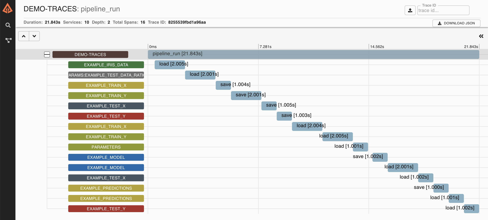

# demo-traces

This Kedro project demonstrates the usage of [Zipkin](https://zipkin.io/) to trace Kedro I/O operations.

## Usage

1. Run Zipkin backend with `docker-compose`:

```console
docker-compose up -d
```

2. Run the Kedro pipeline

```console
kedro run
```

3. Launch zipkin UI. You should see the visualisation of a Kedro run annotated with time spent on each I/O operation:



## How it works

See [tracing_transformers.py](./src/demo_traces/tracing_transformers.py) and [run.py](./src/demo_traces/run.py)
